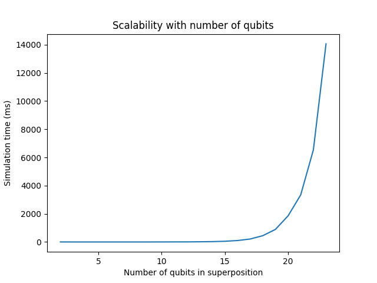

# CS 238 Homework: Implement a quantum circuit simulator
*Jason Cheng*

The code is available at https://github.com/jc65536/quantum-simulator

## Design

My design supports up to 64 qubits, since `BitVec` is a `u64`. I made sure my
amplitudes were also using `u64`, so that they are long enough to represent
amplitudes up to and including $2^{64 / 2}$.

The actual number of qubits $n$ is determined from the program. I realized
that cirq doesn't actually care about the `qreg` statement, but counts the
number of actual qubits used instead. Similarly, my program counts the number of
qubits used across instructions and uses that as $n$.

Of course, the user can always override the detected number of qubits by setting `n` in `State`.

## Evaluation

To test my simulator, I ran it on all the given benchmarks. They all passed
correctness checks.

For scalability, I generated programs from 2 to 24 qubits, where a Hadamard gate
is applied to each qubit to make them be in superposition. The runtime increases
exponentially as the number of qubits in superposition increases.



## Instructions

### How to provide input

Pass in a string of the quantum program to `csm238.simulate`

### How to run the program

First, build the project
```
$ cargo build --release
```

Next, move/copy/link the shared library to the desired working directory. Note
the file needs to be renamed to `cs238.so`.
```
$ ln -s ./target/release/libcs238.so ./desired/directory/cs238.so
```

Use `cs238.so` as if it were a Python module.
```py
from cs238 import simulate

simulate("quantum program here")
```

### How to understand the output

The output of `cs238.simulate` is compatible with that of `cirq`. This means
that qubits are in big-endian order, e.g. $|q_0 q_1 q_2 q_3\rangle = |0101\rangle = |5\rangle$. The output is a list of complex amplitudes. The
complex number at index $k$ is the amplitude for state $| q_0 \dotsb q_n \rangle = | k \rangle$.
